# ICMwRIPER-5 (Iterative Context Management with RIPER-5) Method

A cross-platform AI-assisted software development methodology that iteratively applies 1 human-driven Context Management step and 5 [RIPER-5](https://forum.cursor.com/t/i-created-an-amazing-mode-called-riper-5-mode-fixes-claude-3-7-drastically/65516) rules (Research, Innovate, Plan, Execute, Review) to guide AI code generation, producing higher-quality code that better meets your requirements.

**Supported Platforms**: Ubuntu (WSL2), macOS, and Windows PowerShell

## Cheatsheet for WSL2-Ubuntu/macOS/Windows-PowerShell

```bash

# create-html-data-dashboard
icm4u/icm4m/icm4p.ps1 create-html-data-dashboard <project-name>

# create-nextjs-web-app
icm4u/icm4m/icm4p.ps1 create-nextjs-web-app <project-name>

# snb
icm4u/icm4m/icm4p.ps1 snb <source-story-file>

# bubble-only
icm4u/icm4m/icm4p.ps1 bo

# dialog-log
icm4u/icm4m/icm4p.ps1 d

```

## The Problem

Directly presenting final requirements to AI often leads to code generation that deviates from intended outcomes because the AI lacks human intervention during the development process. Without structured guidance, AI assistants may:

- Make assumptions that don't align with your actual needs
- Skip important planning steps and jump directly to implementation
- Generate code that technically works but doesn't solve the right problem
- Introduce unnecessary complexity or miss edge cases
- Drift away from the original vision as the codebase evolves

## The Solution: ICMwRIPER-5 Method

ICMwRIPER-5 provides a structured, iterative approach that keeps both human and AI aligned throughout the development lifecycle. By separating concerns into distinct phases and maintaining clear context management, this method ensures that AI-generated code stays on track and meets actual requirements.

## Platform Support

ICMwRIPER-5 provides native command-line tools for Ubuntu, macOS, and Windows PowerShell environments:

### Ubuntu (WSL2)
- **Environment**: Windows 11 with WSL2 (Ubuntu 24.04 or later)
- **Command**: `icm4u`
- **Installation**: Global installation to `/usr/local/bin/`
- **Prerequisites**: Git, curl

### macOS
- **Environment**: macOS Sequoia 15.6.1 or later
- **Command**: `./icm4m` (local script)
- **Installation**: Local script usage
- **Prerequisites**: iTerm2, zsh, Git, curl

### Windows PowerShell
- **Environment**: Windows 11 with PowerShell 7.5.3 or later, or Windows 11 default PowerShell 5.1
- **Command**: `icm4p.ps1` (after global install) or `pwsh -File icm4p.ps1` (local script)
- **Installation**: Optional global installation to user PATH or local script usage
- **Prerequisites**: PowerShell 7.5.3+ or PowerShell 5.1 (default on Windows 11), Git
- **Note for PowerShell 5.1 users**: Before running `icm4p.ps1`, execute `Set-ExecutionPolicy RemoteSigned -Scope CurrentUser` to enable script execution. Otherwise you may see an error: "icm4p.ps1 cannot be loaded because running scripts is disabled on this system."

All three implementations provide identical functionality with platform-specific optimizations for the best native experience.

## How It Works

```mermaid
%%{init: {'theme':'base', 'themeVariables': { 'primaryColor':'#ffffff'}}}%%
flowchart TD
    Start([Start New Iteration]) --> ICM["<div style='text-align: left'>Phase 1: Iterative Context Management<br/>by human<br/><br/>Review & update:<br/>• icm-story-yyyy-mm-dd--hh-mm.md<br/>• icm-bubble-yyyy-mm-dd--hh-mm.md<br/>• Reference latest context file<br/>• Reference icmwriper-5.md</div>"]

    ICM --> SendPrompt["<div style='text-align: left'>Send prompts from bubble file to AI</div>"]

    SendPrompt --> Research["<div style='text-align: left'>Phase 2: RESEARCH<br/>by AI & human<br/><br/>MODE: RESEARCH<br/><br/>• Information gathering & file reading only<br/>• AI clarifies requirements with human<br/>• No code changes or implementation decisions</div>"]

    Research --> Innovate["<div style='text-align: left'>Phase 3: INNOVATE<br/>by AI & human<br/><br/>MODE: INNOVATE<br/><br/>• Brainstorm approaches without implementation<br/>• Propose multiple solution strategies<br/>• Discuss trade-offs</div>"]

    Innovate --> Plan["<div style='text-align: left'>Phase 4: PLAN<br/>by AI & human<br/><br/>MODE: PLAN<br/><br/>• Create technical specifications<br/>• Save to: todo-yyyy-mm-dd--hh-mm.md<br/>• Plan must be detailed enough to execute mechanically</div>"]

    Plan --> Execute["<div style='text-align: left'>Phase 5: EXECUTE<br/>by AI & human<br/><br/>MODE: EXECUTE<br/><br/>• Follow the plan exactly<br/>• No creative decisions<br/>• Implement only what was specified</div>"]

    Execute --> Review["<div style='text-align: left'>Phase 6: REVIEW<br/>by AI & human<br/><br/>MODE: REVIEW<br/><br/>• Validate implementation against plan<br/>• Check: completeness, correctness, alignment</div>"]

    Review --> GenContext["<div style='text-align: left'>Phase 7: GENERATE NEW CONTEXT FILE<br/>by human<br/><br/>Ask AI to generate:<br/>• icm-context-yyyy-mm-dd--hh-mm.md<br/><br/>• Reflects current project state<br/>• Used for sharing context with other AI assistants</div>"]

    GenContext --> Decision{Need another<br/>iteration?}

    Decision -->|Yes| ICM
    Decision -->|No| End([End])

    style ICM fill:#e1f5ff
    style Research fill:#fff4e1
    style Innovate fill:#ffe1f5
    style Plan fill:#e1ffe1
    style Execute fill:#ffe1e1
    style Review fill:#f5e1ff
    style GenContext fill:#e1e1ff
    style Start fill:#90EE90
    style End fill:#FFB6C1
```



The ICMwRIPER-5 method consists of seven distinct phases that create a collaborative workflow between human and AI:

### 1. **Iterative Context Management (by human)**
Iteratively review and update two key files:
- `icm-story-yyyy-mm-dd--hh-mm.md` - Story description for the current iteration
- `icm-bubble-yyyy-mm-dd--hh-mm.md` - Starting prompts for the AI (bubbles visualize the chat bubbles between humans and AI). Mentioning the latest context file (`icm-context-yyyy-mm-dd--hh-mm.md`) and the RIPER-5 protocol rules (`icmwriper-5.md`) in the bubble file if applicable.

This ensures proper alignment of AI context before entering the RIPER-5 iteration. Once ready, send the prompts from `icm-bubble-yyyy-mm-dd--hh-mm.md` to the AI to begin.

### 2. **RESEARCH (by AI & human)**
Information gathering and file reading only. No code changes or implementation decisions are made. The AI explores the codebase, reads relevant files, and gathers necessary context.

**Critical**: AI assistants must declare `[MODE: RESEARCH]` at the start of their response.

### 3. **INNOVATE (by AI & human)**
Brainstorming approaches without implementation. The AI proposes multiple solution strategies, discusses trade-offs, and collaborates with you to select the best approach.

**Critical**: AI assistants must declare `[MODE: INNOVATE]` at the start of their response.

### 4. **PLAN (by AI & human)**
Create comprehensive technical specifications and save them to a timestamped todo file (`todo-yyyy-mm-dd--hh-mm.md`). The plan should be detailed enough to execute mechanically.

**Critical**: AI assistants must declare `[MODE: PLAN]` at the start of their response.

### 5. **EXECUTE (by AI & human)**
Follow the plan exactly with no creative decisions. The AI implements only what was specified in the plan, ensuring predictable outcomes and preventing scope creep.

**Critical**: AI assistants must declare `[MODE: EXECUTE]` at the start of their response.

### 6. **REVIEW (by AI & human)**
Validate implementation against the original plan. Check for completeness, correctness, and alignment with requirements. 

**Critical**: AI assistants must declare `[MODE: REVIEW]` at the start of their response.

### 7. **GENERATE NEW CONTEXT FILE (by human)**
Ask your AI assistant to generate a new context file (`icm-context-yyyy-mm-dd--hh-mm.md`) to reflect the current state of the project. This file is used to share the project context with other AI assistants or team members. Then return to phase 1 for the next iteration.

**Critical**: Human must ask your AI assistant to generate a new context file at the end of each iteration.

## Getting Started

Choose your platform and follow the corresponding installation instructions:

### 1. Ubuntu Installation (WSL2)

#### Prerequisites
- Windows 11 with WSL2 (Ubuntu 24.04 or later)
- Git installed in WSL2
- curl installed in WSL2

#### Installation Steps

1. **Clone the repository**:
   ```bash
   git clone https://github.com/wubin28/ICMwRIPER-5.git
   cd ICMwRIPER-5
   ```

2. **Install the command globally**:
   ```bash
   sudo cp icm4u /usr/local/bin/
   sudo chmod +x /usr/local/bin/icm4u
   ```

3. **Verify installation**:
   ```bash
   which icm4u
   ```

   You should see: `/usr/local/bin/icm4u`

4. **Test the command**:
   ```bash
   icm4u b
   ```

   This will create a new directory `my-test-project` with the ICMwRIPER-5 template files.

### 2. macOS Installation

#### Prerequisites
- macOS Sequoia 15.6.1 or later
- iTerm2 terminal application
- zsh shell (default on modern macOS)
- Git installed (via Xcode Command Line Tools or Homebrew)
- curl installed (included with macOS)

#### Installation Steps

1. **Clone the repository**:
   ```bash
   git clone https://github.com/wubin28/ICMwRIPER-5.git
   cd ICMwRIPER-5
   ```

2. **Make the script executable**:
   ```bash
   chmod +x icm4m
   ```

3. **Test the command**:
   ```bash
   ./icm4m b
   ```

   This will create a new directory `my-test-project` with the ICMwRIPER-5 template files.

### 3. Windows PowerShell Installation

#### Prerequisites
- Windows 11
- PowerShell 7.5.3 or later (install from [PowerShell GitHub releases](https://github.com/PowerShell/PowerShell/releases)), or PowerShell 5.1 (default on Windows 11)
- Git installed (via Git for Windows or other installer)

**Important for PowerShell 5.1 users**: This project also supports Windows 11 default PowerShell 5.1. Before running `icm4p.ps1`, you must first run `Set-ExecutionPolicy RemoteSigned -Scope CurrentUser` to enable script execution. Otherwise, you may see an error: "icm4p.ps1 cannot be loaded because running scripts is disabled on this system. For more information, see about_Execution_Policies at https:/go.microsoft.com/fwlink/?LinkID=135170."

#### Installation Steps

1. **Set execution policy** (PowerShell 5.1 users only):
   ```powershell
   Set-ExecutionPolicy RemoteSigned -Scope CurrentUser
   ```
   
   This step is not required for PowerShell 7.5.3+ users.

2. **Clone the repository**:
   ```powershell
   git clone https://github.com/wubin28/ICMwRIPER-5.git
   cd ICMwRIPER-5
   ```

3. **Install the command globally** (optional but recommended):

   **IMPORTANT**: Execute each segment separately by copying and pasting one at a time:

   **Segment 1: Create directory and copy file**
   ```powershell
   $userScriptsPath = "$env:USERPROFILE\Documents\PowerShell\Scripts"
   New-Item -Path $userScriptsPath -ItemType Directory -Force
   Copy-Item icm4p.ps1 $userScriptsPath\
   ```

   **Segment 2: Set environment variables**
   ```powershell
   $env:PATH += ";$userScriptsPath"
   [Environment]::SetEnvironmentVariable("PATH", $env:PATH + ";$userScriptsPath", "User")
   ```

   **Note on Script Renaming**: If you rename `icm4p.ps1` in the future (e.g., to `icm4p-new-name.ps1`), update the global installation by running:
   ```powershell
   $userScriptsPath = "$env:USERPROFILE\Documents\PowerShell\Scripts"
   Copy-Item icm4p-new-name.ps1 $userScriptsPath\
   ```

4. **Verify installation** (if globally installed):
   ```powershell
   # Restart PowerShell session, then test
   icm4p.ps1 b
   ```

5. **Alternative: Test without global installation**:
   ```powershell
   pwsh -File icm4p.ps1 b
   ```

   This will create a new directory `my-test-project` with the ICMwRIPER-5 template files.

#### What the Commands Do

All three commands (`icm4u`, `icm4m`, and `icm4p.ps1`) provide identical functionality:
- Creates a new project directory with the specified name
- Downloads the following template files from this repository:
  - `icm-bubble-template.md` - Starting prompt template
  - `icm-story-template.md` - Story description template
  - `icmwriper-5.md` - RIPER-5 protocol rules
  - `icmwriper-5-README.md` - This README file (renamed from README.md)

### 4. Command Usage

The platform commands provide essential subcommands for managing your ICMwRIPER-5 projects:
- **Ubuntu**: 5 subcommands
- **macOS**: 5 subcommands
- **Windows PowerShell**: 5 subcommands

**Command syntax**:
- **Ubuntu**: `icm4u <subcommand> <argument>`
- **macOS**: `./icm4m <subcommand> <argument>`
- **Windows**: `icm4p.ps1 <subcommand> <argument>` (after global install) or `pwsh -File icm4p.ps1 <subcommand> <argument>` (local script)

#### snb - Create Matched Story-Bubble Pair

**Syntax**:
- **Ubuntu**: `icm4u snb <source-story-file>`
- **macOS**: `./icm4m snb <source-story-file>`
- **Windows**: `pwsh -File icm4p.ps1 snb <source-story-file>`

**Purpose**: Create both story and bubble files simultaneously with identical timestamps

**Examples**:

**Ubuntu**:
```bash
icm4u snb <source-story-file>
# Output: icm-story-2025-10-03--22-26.md and icm-bubble-2025-10-03--22-26.md
```

**macOS**:
```bash
./icm4m snb <source-story-file>
# Output: icm-story-2025-10-05--23-33.md and icm-bubble-2025-10-05--23-33.md
```

**Windows PowerShell**:
```powershell
pwsh -File icm4p.ps1 snb <source-story-file>
# Output: icm-story-2025-10-16--11-46.md and icm-bubble-2025-10-16--11-46.md
```

**What it does**:
- Copies the source story file with current timestamp
- Copies `icm-bubble-template.md` with the same timestamp
- Automatically updates story file references in the bubble file

**Benefit**: Ensures perfect pairing of story and bubble files with one command.

#### b - Create Timestamped Log File

**Syntax**:
- **Ubuntu**: `icm4u b`
- **Windows**: `pwsh -File icm4p.ps1 b`

**Purpose**: Create an empty timestamped markdown file for logging or notes

**Examples**:

**Ubuntu**:
```bash
icm4u b
# Output: bubble-2025-10-16--12-15.md
```

**Windows PowerShell**:
```powershell
pwsh -File icm4p.ps1 b
# Output: bubble-2025-10-16--12-15.md
```

**macOS**:
```bash
./icm4m b
# Output: bubble-2025-10-16--22-25.md
```

**What it does**:
- Creates an empty (0-byte) markdown file with current timestamp
- Uses current system timestamp (independent of story files)
- Useful for quick session notes or logging

#### bo - Create Bubble-Only File with Template Content

**Syntax**:
- **Ubuntu**: `icm4u bo`
- **macOS**: `./icm4m bo`
- **Windows**: `pwsh -File icm4p.ps1 bo`

**Purpose**: Create a timestamped bubble file with pre-populated template content for standalone AI prompts

**Examples**:

**Ubuntu**:
```bash
icm4u bo
# Output: icm-bubble-only-2025-10-17--14-22.md
```

**macOS**:
```bash
./icm4m bo
# Output: icm-bubble-only-2025-10-17--14-22.md
```

**Windows PowerShell**:
```powershell
pwsh -File icm4p.ps1 bo
# Output: icm-bubble-only-2025-10-17--14-22.md
```

**What it does**:
- Creates a markdown file with content copied from `icm-bubble-only-template.md`
- Uses current system timestamp (independent of story files)
- Filename format: `icm-bubble-only-<timestamp>.md`
- Useful for creating standalone prompts that can be directly copied to AI tools

**Key difference from 'b' command**: The 'b' command creates an empty file, while 'bo' creates a file with template content

#### create-html-data-dashboard - Create Data Dashboard Project

**Syntax**:
- **Ubuntu**: `icm4u create-html-data-dashboard <project-name>`
- **macOS**: `./icm4m create-html-data-dashboard <project-name>`
- **Windows**: `pwsh -File icm4p.ps1 create-html-data-dashboard <project-name>`

**Purpose**: Bootstrap a new ICMwRIPER-5 project with additional data dashboard resources

**Examples**:

**Ubuntu**:
```bash
icm4u create-html-data-dashboard my-dashboard-project
```

**macOS**:
```bash
./icm4m create-html-data-dashboard my-dashboard-project
```

**Windows PowerShell**:
```powershell
pwsh -File icm4p.ps1 create-html-data-dashboard my-dashboard-project
```

**What it does**:
- Creates project directory with 7 files
- Downloads standard template files plus:
  - `first-80-rows-agentic_ai_performance_dataset_20250622.xlsx` - Sample dataset
  - `.gitignore` - Git ignore configuration
  - `icm-bubble-only-template.md` - Template for standalone bubble files
- Specialized for Python/HTML/CSS/JavaScript data visualization projects

#### create-nextjs-web-app - Create Next.js Web App Project

**Syntax**:
- **Ubuntu**: `icm4u create-nextjs-web-app <project-name>`
- **macOS**: `./icm4m create-nextjs-web-app <project-name>`
- **Windows**: `pwsh -File icm4p.ps1 create-nextjs-web-app <project-name>`

**Purpose**: Bootstrap a new ICMwRIPER-5 project with Next.js web app resources

**Examples**:

**Ubuntu**:
```bash
icm4u create-nextjs-web-app my-nextjs-app
```

**macOS**:
```bash
./icm4m create-nextjs-web-app my-nextjs-app
```

**Windows PowerShell**:
```powershell
pwsh -File icm4p.ps1 create-nextjs-web-app my-nextjs-app
```

**What it does**:
- Creates project directory with 6 files
- Downloads standard template files plus:
  - `icm-bubble-template-for-nextjs-web-app.md` - Next.js-specific bubble template
  - `icm-story-template-for-nextjs-web-app.md` - Next.js-specific story template
  - `.gitignore` - Next.js-specific Git ignore configuration
  - `icm-bubble-only-template.md` - Template for standalone bubble files
- Specialized for Next.js/React/TypeScript web application projects

**Platform availability**: All platforms (Ubuntu, macOS, Windows PowerShell)

### 5. Context Management and AI Tool Switching

#### Generating Context Files

During project development, you can create a comprehensive context file to:
- Switch to other AI tools while preserving project state
- Clear the current AI chat context and start fresh with full context
- Share project status with team members
- Document project milestones

**Context file naming convention**: `icm-context-yyyy-mm-dd--hh-mm.md`

**When to create**:
- Before switching from one AI assistant to another
- When the chat context becomes too large or cluttered
- After completing major milestones
- Before taking breaks in development

**How to create**:
Ask your AI assistant to create a comprehensive context file documenting:
- Executive summary of the project
- Business requirements implemented
- Technical architecture and design decisions
- Implementation details
- Usage examples
- Current status and next steps

**Example prompt**:
```
Please create a comprehensive context file named icm-context-2025-10-03--22-26.md
documenting the current state of the project, including all implemented features,
technical architecture, and key design decisions.
```

**Using context files**:
- Share the context file with a new AI assistant session
- Reference it when continuing work after clearing context
- Include it in project documentation for onboarding

### 6. Create Your First Iteration

When starting a new iteration:

1. Use the `snb` command to create matched story-bubble files:

   **Ubuntu**:
   ```bash
   icm4u snb <source-story-file>
   ```

   **macOS**:
   ```bash
   ./icm4m snb <source-story-file>
   ```

   **Windows PowerShell**:
   ```powershell
   # After global installation
   icm4p.ps1 snb <source-story-file>

   # Or without global installation
   pwsh -File icm4p.ps1 snb <source-story-file>
   ```

   Or create them separately using `story` and `bubble` commands.

2. Edit the created story file (`icm-story-yyyy-mm-dd--hh-mm.md`) according to your specific iteration requirements

3. Edit the created bubble file (`icm-bubble-yyyy-mm-dd--hh-mm.md`) with appropriate prompts for your AI assistant

4. Send the prompts from `icm-bubble-yyyy-mm-dd--hh-mm.md` to your AI assistant to begin the RIPER-5 workflow

### 7. Follow the Workflow

Progress through each RIPER-5 phase systematically. Ensure your AI assistant declares the current mode at the start of each response. When the AI ​​stops in each mode and waits for your signals, carefully check the AI's output and, if necessary, ask the AI ​​to make adjustments until you are satisfied before issuing the signal to enter the next mode.

## Bug Fix History

### SNB Subcommand Bug Fix (2025-10-20)

**Issue**: When first executing the "snb" subcommand after creating a project with `create-nextjs-web-app`, the current directory might not contain "icm-bubble-template.md" but instead contains files like "icm-bubble-template-for-nextjs-web-app.md".

**Root Cause**: The original implementation hardcoded the template filename as "icm-bubble-template.md" instead of dynamically searching for files starting with "icm-bubble-template".

**Fix Applied**: Modified all three platform scripts (icm4u, icm4m, icm4p.ps1) to:
- Use `find` command (Unix) or `Get-ChildItem` (PowerShell) to search for files starting with "icm-bubble-template"
- Sort the results and use the first matching file as the template
- Update success messages to reflect the actual template file used

**Impact**: The snb subcommand now works correctly in all project types, automatically adapting to the specific bubble template file available in the current directory.

**Files Modified**:
- `/home/ben/OOR/katas/ICMwRIPER-5/icm4u` (already fixed)
- `/home/ben/OOR/katas/ICMwRIPER-5/icm4m` (fixed in this update)
- `/home/ben/OOR/katas/ICMwRIPER-5/icm4p.ps1` (fixed in this update)

### Missing icm-bubble-only-template.md Bug Fix (2025-10-21)

**Issue**: When executing the `bo` command after creating a project with either `create-nextjs-web-app` or `create-html-data-dashboard`, the script reported an error: "Error: File 'icm-bubble-only-template.md' does not exist."

**Root Cause**: Both project creation commands did not include `icm-bubble-only-template.md` in their list of files to download from GitHub, even though the `bo` command requires this template file to function.

**Fix Applied**: Modified all three platform scripts (icm4u, icm4m, icm4p.ps1) to:
- Add `icm-bubble-only-template.md` to the downloaded files in both `create-nextjs-web-app` and `create-html-data-dashboard` commands
- Update file count in success messages to reflect the additional file

**Impact**: The `bo` command now works correctly immediately after project creation on all platforms without requiring manual template file setup.

**Files Modified**:
- `/home/wzb/OOR/katas/ICMwRIPER-5/icm4u`
- `/home/wzb/OOR/katas/ICMwRIPER-5/icm4m`
- `/home/wzb/OOR/katas/ICMwRIPER-5/icm4p.ps1`

**Updated File Counts**:
- `create-nextjs-web-app`: Now downloads 6 files (was 5)
- `create-html-data-dashboard`: Now downloads 7 files (was 6)

## Project Structure

```
├── icm-bubble-template.md              # Starting prompt template
├── icm-bubble-only-template.md         # Standalone prompt template (no story required)
├── icm-story-template.md               # Story description template
├── icm4u              # Command-line tool for Ubuntu (WSL2)
├── icm4m               # Command-line tool for macOS
├── icm4p.ps1            # Command-line tool for Windows PowerShell
├── icmwriper-5.md                      # Updated RIPER-5 protocol rules
├── README.md                           # This file
├── icm-bubble-yyyy-mm-dd--hh-mm.md     # Iteration prompts (created per iteration)
├── icm-bubble-only-yyyy-mm-dd--hh-mm.md # Standalone prompts (created by bo command)
├── icm-story-yyyy-mm-dd--hh-mm.md      # Iteration stories (created per iteration)
├── icm-context-yyyy-mm-dd--hh-mm.md    # Context snapshots (for AI tool switching)
├── bubble-yyyy-mm-dd--hh-mm.md         # Log files (created by b command)
└── todo-yyyy-mm-dd--hh-mm.md           # Task tracking (created during PLAN phase)
```

## Key Benefits

- **Controlled AI Behavior**: Explicit mode declarations prevent AI from jumping ahead or making unplanned decisions
- **Human Oversight**: Each phase requires human review and approval before proceeding
- **Iterative Refinement**: Regular return to Context Management keeps the project aligned with evolving requirements
- **Clear Documentation**: Timestamped files create an audit trail of decision-making
- **Predictable Outcomes**: Separation of planning and execution reduces unexpected surprises
- **Better Code Quality**: Thorough research and planning phases lead to more thoughtful implementations

## Use Cases

ICMwRIPER-5 is particularly effective for:

- **Complex Feature Development**: Multi-step features requiring careful planning
- **Refactoring Projects**: Large-scale code reorganization where AI might otherwise introduce breaking changes
- **Learning New Codebases**: Systematic exploration before making changes
- **Team Collaboration**: Clear phases make it easier to hand off work between team members
- **Quality-Critical Projects**: Applications where correctness is more important than speed

## Best Practices

1. **One Phase at a Time**: Don't skip phases or combine them
2. **Document Everything**: Keep thorough notes in your story and bubble files
3. **Review Before Proceeding**: Always validate AI output before moving to the next phase
4. **Update Context Regularly**: Return to Context Management phase when requirements change
5. **Enforce Mode Declarations**: Ensure your AI assistant explicitly declares its mode
6. **Maintain Timestamps**: Use consistent naming for all iteration files
7. **Platform Consistency**: When working on cross-platform projects, test changes across all supported platforms
8. **Command Usage**: Use the appropriate command for your platform:
   - Ubuntu: Use `icm4u` after global installation
   - macOS: Use `./icm4m` as a local script
   - Windows: Use `icm4p.ps1` after global installation, or `pwsh -File icm4p.ps1` for local script execution

## Contributing

We welcome contributions to improve the ICMwRIPER-5 methodology:

- Share your experience using the method
- Propose enhancements to the workflow
- Submit example projects demonstrating the methodology
- Improve documentation and templates

## Security

- Handle sensitive operations with appropriate user confirmation
- Never commit API keys or sensitive data
- Validate all file operations before execution
- Review AI-generated code carefully before deployment

## Further Reading

For detailed protocol specifications, see `icmwriper-5.md` in this repository.

## License

This project is licensed under the MIT License - see the LICENSE file for details.

---

The orginial RIPER framework is by: [robotlovehuman](https://forum.cursor.com/t/i-created-an-amazing-mode-called-riper-5-mode-fixes-claude-3-7-drastically/65516)